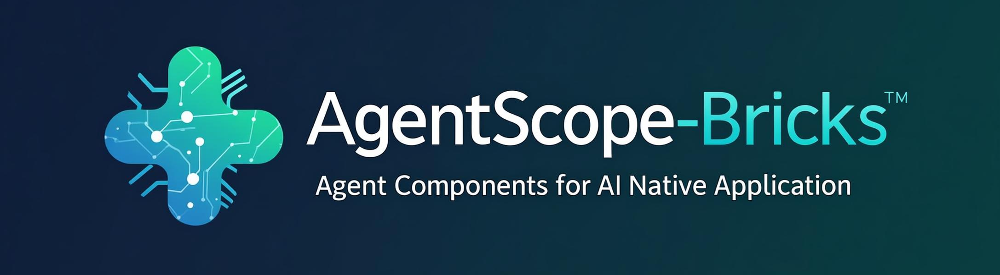

# AgentScope-Bricks

<p align="center">
    <br>
    
    <br>
<p>

<a href="https://bailian.console.aliyun.com"> Aliyun Modelstudio Website</a>

## What is AgentScope-Bricks?

Agentscope-Bricks is a **componentized AI application development framework** that provides enterprise-grade,
modular components for building sophisticated AI-powered applications. Built around Alibaba Cloud Modelstudio services,
it offers an unified API for creating scalable AI agents with production-ready capabilities.

### Key Features

- 🧩 **Modular Component Architecture**: Single-responsibility components with clear input/output definitions
- 🔌 **Open-Source Framework Integration**: Native support for LangGraph, AutoGen, LlamaIndex, and AgentScope, more on the road
- ⚡ **High Performance**: Async-first design with streaming support
- 🔒 **Enterprise Security**: Built-in security features and error handling
- 🎯 **Type Safety**: Full Pydantic integration for robust data validation

## Table of Contents

- [Getting Started](#getting-started)
  - [Installation](#installation)
  - [Quick Example](#quick-example)
    - [Custom component development](#1-custom-component-development)
    - [Build agent with Agentscope family](#2-build-agent-with-agentscope-family)
    - [Apply to exists project](#3-more-open-source-adaptions)
- [Agent Development, Debugging & Deployment](#agent-development-debugging--deployment)
  - [Agent Development](#agent-development)
    - [Using Built-in Frameworks](#using-built-in-frameworks)
    - [Custom Agent Development](#custom-agent-development)
    - [Agent Schemas Protocol](#agent-schemas-protocol)
  - [Agent Debugging](#agent-debugging)
  - [Agent Deployment](#agent-deployment)
- [Why Agentscope-Bricks?](#why-agentscope-bricks)
- [Contributing](#contributing)
- [License](#license)

## Getting Started

### Installation

```bash
# Basic installation
pip install agentscope-bricks

# Development installation
pip install -e .
```

**Prerequisites:**
- Python 3.10+
- `DASHSCOPE_API_KEY` environment variable for Alibaba Cloud services

### Quick Example

#### 1. Custom component development

Build type-safe, reusable components with automatic schema generation:

```python
import asyncio
from agentscope_bricks.base.component import Component
from pydantic import BaseModel, Field
from typing import Any

# Define input/output schemas
class SearchInput(BaseModel):
    query: str = Field(..., description="Search query")
    max_results: int = Field(default=10, description="Maximum results")
    context: dict = Field(default_factory=dict)

class SearchOutput(BaseModel):
    results: list[str] = Field(..., description="Search results")
    total_found: int = Field(..., description="Total results found")
    context: dict = Field(..., description="Updated context")

# Implement your component
class SearchComponent(Component[SearchInput, SearchOutput]):
    async def _arun(self, args: SearchInput, **kwargs: Any) -> SearchOutput:
        # Your search logic here
        results = [f"Result for '{args.query}' #{i+1}" for i in range(args.max_results)]

        return SearchOutput(
            results=results,
            total_found=len(results),
            context={**args.context, "last_query": args.query}
        )

# Use the component
async def main():
    component = SearchComponent(
        name="Enterprise Search",
        description="High-performance search component"
    )

    result = await component.arun(SearchInput(query="AI agents", max_results=5))
    print(f"Found {result.total_found} results:")
    for r in result.results:
        print(f"  - {r}")

    # Component automatically generates OpenAI-compatible function schema
    print("\nFunction Schema:")
    print(component.function_schema)

asyncio.run(main())
```

#### 2. Build agent with Agentscope family

Build agent with [Agentscope-Runtime](https://github.com/agentscope-ai/agentscope-runtime) and
[AgentScope](https://github.com/agentscope-ai/agentscope)

```python
import asyncio
import os
from typing import Any
from agentscope_runtime.engine import Runner
from agentscope_runtime.engine.agents.agentscope_agent import AgentScopeAgent

from agentscope_runtime.engine.services.environment_manager import \
    EnvironmentManager
from agentscope_runtime.engine.services.context_manager import \
    ContextManager
from agentscope_runtime.engine.schemas.agent_schemas import (
    MessageType,
    RunStatus,
    AgentRequest,
)

from agentscope.agent import ReActAgent
from agentscope.model import DashScopeChatModel

from agentscope_bricks.adapters.agentscope_runtime.tool import (
    AgentScopeRuntimeToolAdapter,
)
from agentscope_bricks.components import Component

from pydantic import BaseModel, Field

# Initialize the instance

model = DashScopeChatModel(
    "qwen-max",
    api_key=os.getenv("DASHSCOPE_API_KEY"),
)

SYSTEM_PROMPT = """You are a helpful AI assistant.

# Objective
Your goal is to complete given tasks by using registry tools
"""

print("✅系统提示词已配置")
search_tool = AgentScopeRuntimeToolAdapter(SearchComponent())

# Create the AgentScope agent
agent = AgentScopeAgent(
    name="Friday",
    model=model,
    agent_config={
        "sys_prompt": SYSTEM_PROMPT,
    },
    tools=[search_tool],
    agent_builder=ReActAgent,
)
runner_instance = Runner(
    agent=agent,
    context_manager=ContextManager(),
    environment_manager=EnvironmentManager(),
)

# interact with agent
async def interact(runner):
    # Create a request
    request = AgentRequest(
        input=[
            {
                "role": "user",
                "content": [
                    {
                        "type": "text",
                        "text": "What is weather in beijing?",
                    },
                ],
            },
        ],
    )

    # Stream interaction with the agent
    print("🤖 智能体正在处理您的请求...")
    async for message in runner.stream_query(
        request=request,
    ):
        # Check if this is a completed message
        if (
            message.object == "message"
            and MessageType.MESSAGE == message.type
            and RunStatus.Completed == message.status
        ):
            all_result = message.content[0].text

    print("📝 智能体输出:", all_result)


asyncio.run(interact(runner_instance))
```

#### 3. More open-source adaptions

Apply component to an exists Langgraph project

```python
# -*- coding: utf-8 -*-
from langchain_core.messages import HumanMessage
from langchain_openai import ChatOpenAI
from langgraph.checkpoint.memory import MemorySaver
from langgraph.graph import END, START, MessagesState, StateGraph
from pydantic import BaseModel, Field
from typing import Literal, Any
import os
from agentscope_bricks.adapters.langgraph.tool import LanggraphNodeAdapter
import asyncio

tool_node = LanggraphNodeAdapter(
    [
        SearchComponent(),
    ],
)

api_key = os.getenv("DASHSCOPE_API_KEY")

model = ChatOpenAI(
    model="qwen-turbo",
    openai_api_key=api_key,
    openai_api_base="https://dashscope.aliyuncs.com/compatible-mode/v1",
).bind_tools(tool_node.tool_schemas)


# Define the function that determines whether to continue or not
def should_continue(state: MessagesState) -> Literal["tools", END]:
    messages = state["messages"]
    last_message = messages[-1]
    # If the LLM makes a tool call, then we route to the "tools" node
    if last_message.tool_calls:
        return "tools"
    # Otherwise, we stop (reply to the user)
    return END


# Define the function that calls the model
def call_model(state: MessagesState):
    messages = state["messages"]
    response = model.invoke(messages)
    # We return a list, because this will get added to the existing list
    return {"messages": [response]}


# Define a new graph
workflow = StateGraph(MessagesState)

# Define the two nodes we will cycle between
workflow.add_node("agents", call_model)
workflow.add_node("tools", tool_node)

# Set the entrypoint as `agents`
# This means that this node is the first one called
workflow.add_edge(START, "agents")

# We now add a conditional edge
workflow.add_conditional_edges(
    # First, we define the start node. We use `agents`.
    # This means these are the edges taken after the `agents` node is called.
    "agents",
    # Next, we pass in the function that will determine which
    # node is called next.
    should_continue,
)

# We now add a normal edge from `tools` to `agents`.
# This means that after `tools` is called, `agents` node is called next.
workflow.add_edge("tools", "agents")

# Initialize memory to persist state between graph runs
checkpointer = MemorySaver()

# Finally, we compile it!
# This compiles it into a LangChain Runnable,
# meaning you can use it as you would any other runnable.
# Note that we're (optionally) passing the memory when compiling the graph
app = workflow.compile(checkpointer=checkpointer)

# Use the Runnable
final_state = app.invoke(
    {"messages": [HumanMessage(content="what is the weather in sf")]},
    config={"configurable": {"thread_id": 42}},
)
print(final_state["messages"][-1].content)


async def arun():
    final_state_async = await app.ainvoke(
        {"messages": [HumanMessage(content="what is the weather in sf")]},
        config={"configurable": {"thread_id": 42}},
    )
    print(final_state_async["messages"][-1].content)


asyncio.run(arun())
```

## Agent Development, Debugging & Deployment

AgentScope-Bricks provides a complete workflow for agent development, from initial creation to production deployment. The framework supports three main approaches: using built-in frameworks, developing custom agents, and following standard protocols.

### Agent Development

#### Using Built-in Frameworks

AgentScope-Bricks integrates seamlessly with popular AI agent frameworks. You can choose from three pre-built agent implementations:

**1. AgentScope ReAct Agent**
```python
# demos/integrated_with_agentscope_runtime/react_agent_with_agentscope.py
from agentscope.agent import ReActAgent
from agentscope.model import DashScopeChatModel
from agentscope_bricks.adapters.agentscope_runtime.tool import AgentScopeRuntimeToolAdapter
from agentscope_bricks.components.searches.modelstudio_search_lite import ModelstudioSearchLite

# Create model and tools
model = DashScopeChatModel("qwen-max", api_key=os.getenv("DASHSCOPE_API_KEY"))
search_tool = AgentScopeRuntimeToolAdapter(ModelstudioSearchLite())

# Build AgentScope agent with ReAct pattern
agentscope_agent = AgentScopeAgent(
    name="ReAct Assistant",
    model=model,
    agent_config={"sys_prompt": "You are a helpful AI assistant."},
    tools=[search_tool],
    agent_builder=ReActAgent,
)
```

**2. LangGraph Agent**
```python
# demos/integrated_with_agentscope_runtime/react_agent_with_langgraph.py
from langchain_openai import ChatOpenAI
from langgraph.graph import StateGraph, MessagesState
from agentscope_bricks.adapters.langgraph.tool import LanggraphNodeAdapter

# Create LangGraph workflow with state management
tool_node = LanggraphNodeAdapter([ModelstudioSearchLite()])
model = ChatOpenAI(
    model="qwen-turbo",
    openai_api_key=os.getenv("DASHSCOPE_API_KEY"),
    openai_api_base="https://dashscope.aliyuncs.com/compatible-mode/v1",
).bind_tools(tool_node.tool_schemas)

workflow = StateGraph(MessagesState)
workflow.add_node("agent", call_model)
workflow.add_node("tools", tool_node)
# Add conditional edges for tool routing...
```

#### Custom Agent Development

For advanced use cases, you can develop custom agents by extending the base `Agent` class and implementing the standard agent schemas protocol.

**Custom Agent Implementation:**
```python
# demos/integrated_with_agentscope_runtime/react_agent_with_customize_agent.py
from agentscope_runtime.engine.agents.base_agent import Agent
from agentscope_runtime.engine.schemas.agent_schemas import (
    Content, Message, MessageType, Role, Tool
)

class SimpleAgent(Agent):
    def __init__(self, name: str = "", tools: Optional[List[SandboxTool]] = None,
                 agent_config: Optional[dict] = None):
        super().__init__(name=name, agent_config=agent_config)

        # Initialize LLM and tools
        self.llm = BaseLLM(api_key=os.environ.get("DASHSCOPE_API_KEY"))
        self.tools = tools
        self.tool_maps = {tool.name: tool for tool in self.tools}

    async def run_async(self, context: Context, **kwargs) -> AsyncGenerator[Union[Message, Content], None]:
        # Convert context to OpenAI messages
        oai_messages = convert_to_openai_messages(context.request.input)
        oai_tools = [Tool(**tool.schema) for tool in self.tools]

        # Stream LLM response with tool execution
        while True:
            response = self.llm.astream_unwrapped(
                model=context.request.model,
                messages=oai_messages,
                tools=oai_tools,
                **kwargs
            )

            # Handle streaming response and tool calls...
            async for resp in response:
                # Process incremental responses
                # Execute tool calls when needed
                # Yield messages and content
                pass
```

#### Agent Schemas Protocol

When developing custom agents, you **must** follow the standard `agent_schemas` protocol to ensure compatibility with the AgentScope Runtime engine.

**Required Protocol Elements:**

1. **Message Format**: Use OpenAI-compatible message format
```python
from agentscope_runtime.engine.schemas.agent_schemas import (
    Message, Content, MessageType, Role, Tool, FunctionCall
)

# Standard message structure
message = Message(
    role=Role.ASSISTANT,
    type=MessageType.MESSAGE,
    content=[Content(type="text", text="Response text")]
)
```

2. **Tool Integration**: Implement proper tool call handling
```python
from agentscope_bricks.utils.tool_call_utils import execute_tool_call_from_message

# Execute tool calls following the protocol
tool_responses = await execute_tool_call_from_message(
    cumulated_resp, self.tool_maps, **kwargs
)
```

3. **Streaming Support**: Implement async generators for real-time responses
```python
async def run_async(self, context: Context, **kwargs) -> AsyncGenerator[Union[Message, Content], None]:
    # Yield in_progress messages
    yield output_message.in_progress()

    # Yield incremental content
    yield delta_content

    # Yield completed messages
    yield output_message.completed()
```

4. **Context Management**: Handle conversation context properly
```python
from agentscope_runtime.engine.schemas.context import Context

# Access request data
oai_messages = convert_to_openai_messages(context.request.input)
model_name = context.request.model
session_id = context.request.session_id
```

**Protocol Requirements for Custom Agents:**

- **Inherit from `Agent`**: All custom agents must extend `agentscope_runtime.engine.agents.base_agent.Agent`
- **Implement `run_async`**: The main execution method with proper type signatures
- **Use Standard Schemas**: Import and use schemas from `agentscope_runtime.engine.schemas.agent_schemas`
- **Handle Tool Calls**: Properly execute and respond to tool calls using the provided utilities
- **Support Streaming**: Implement async generators for real-time response streaming
- **Message Conversion**: Convert between internal formats and OpenAI message format

### Agent Debugging

The framework provides comprehensive debugging capabilities through the `agent_developement.py` script, which allows you to test and debug different agent implementations interactively.

**Interactive Agent Testing:**
```bash
cd demos/integrated_with_agentscope_runtime
python agent_developement.py
```

**Available Debug Options:**
1. **AgentScope ReAct Agent** - Test ReAct reasoning patterns
2. **LangGraph Agent** - Debug state machine workflows
3. **Simple Custom Agent** - Test custom implementations

**Debug Features:**
- **Real-time Streaming**: See agent responses as they're generated
- **Tool Call Inspection**: Monitor tool executions and results
- **Error Handling**: Catch and display runtime errors
- **Performance Monitoring**: Track response times and usage statistics

**Debug Output Example:**
```bash
Choice agent from (1-3): 3
Input query: What is the weather in Beijing?

🤖 Agent processing your request...
agent output Message(type=MessageType.FUNCTION_CALL, ...)
agent output Content(type="text", text="I'll search for the weather...")
📝 Agent final output: The current weather in Beijing is...
```

**Advanced Debugging:**
```python
# Direct agent usage for debugging
from react_agent_with_customize_agent import simple_agent

async def debug_agent():
    async with create_context_manager() as context_manager:
        runner = Runner(agent=simple_agent, context_manager=context_manager)
        result = await simple_call_agent("Debug query", runner)
    return result

# Run with custom parameters
asyncio.run(debug_agent())
```

### Agent Deployment

Deploy your agents as production-ready services using the `agent_deployment.py` script, which provides HTTP endpoints with streaming support.

**Production Deployment:**
```bash
cd demos/integrated_with_agentscope_runtime
python agent_deployment.py
```

**Deployment Features:**
- **HTTP API**: RESTful endpoints for agent interaction
- **Streaming Responses**: Real-time response streaming via HTTP
- **Health Monitoring**: Built-in health check endpoints
- **Session Management**: Persistent conversation sessions
- **Error Handling**: Graceful error responses and logging

**Deployment Configuration:**
```python
# Configure deployment settings
deploy_manager = LocalDeployManager(
    host="localhost",
    port=8090,
)

# Deploy with streaming support
deploy_result = await runner.deploy(
    deploy_manager=deploy_manager,
    endpoint_path="/process",
    stream=True,
)
```

**API Usage:**
```bash
# Send requests to deployed agent
curl http://localhost:8090/process \
-X POST -H "Content-Type: application/json" \
-d '{
    "model": "qwen-max",
    "input": [
        {
            "role": "user",
            "content": [{"type": "text", "text": "Hello, how can you help me?"}]
        }
    ]
}'

# Health check
curl http://localhost:8090/health
```

**Production Considerations:**
- **Environment Variables**: Set `DASHSCOPE_API_KEY` for model access
- **Resource Management**: Configure memory and CPU limits
- **Logging**: Monitor logs for debugging and performance analysis
- **Security**: Implement authentication and rate limiting as needed
- **Scaling**: Use load balancers for high-traffic scenarios

## Why Agentscope-Bricks?

### 🎯 **Production-Ready from Day One**
- Enterprise-grade components used in production by Alibaba Cloud
- Built-in observability, tracing, and error handling
- Comprehensive testing and validation

### 🔧 **Framework Adaption**
```python
# Works with your favorite frameworks
from agentscope_bricks.adapters.agentscope.tool import agentscope_tool_adapter
from agentscope_bricks.adapters.autogen.tool import AutogenToolAdapter

# Convert to LangGraph node
node = agentscope_tool_adapter(your_component)

# Convert to AutoGen tool
tool = AutogenToolAdapter(your_component)
```

### ⚡ **High Performance**
- Async-first architecture with streaming support
- Efficient memory management and caching
- Optimized for high-throughput scenarios

### 🧩 **Truly Modular**
- Single-responsibility components with clear input output schemas
- Swappable implementations

## Contributing

We welcome contributions! Please see our development guidelines:

### Development Setup

```bash
# Clone the repository
git clone https://github.com/your-org/agentscope-bricks.git
cd agentscope_bricks

# Install development dependencies
pip install . -U
```

### Testing

```bash
# Run all tests
pytest
```

### Code Quality

```bash
pre-commit install
pre-commit run --all-files
```

### Guidelines

- **Component Development**: Follow the single-responsibility principle
- **Type Safety**: Use Pydantic models for all inputs/outputs
- **Testing**: Write comprehensive unit and integration tests
- **Documentation**: Update relevant docs and examples
- **Performance**: Maintain async-first patterns

### Submitting Changes

1. Fork the repository
2. Create a feature branch
3. Make your changes with tests
4. Ensure all tests pass
5. Submit a pull request

## License

This framework is licensed under the [Apache License (Version 2.0)](https://github.com/modelscope/modelscope/blob/master/LICENSE).
For models and datasets, please refer to the original resource page and follow the corresponding License.

---

<p align="center">
  <a href="https://bailian.console.aliyun.com">🌐 Modelstudio Platform</a> |
  <a href="README.md">📖 Documentation</a> |
  <a href="https://github.com/agentscope-ai/agentscope-bricks/issues">🐛 Issues</a> |
  <a href="https://github.com/agentscope-ai/agentscope-bricks/discussions">💬 Discussions</a>
</p>

<p align="center">
  Built with ❤️ by the Alibaba Cloud Modelstudio Team
</p>

<!-- ALL-CONTRIBUTORS-LIST:END -->

This project follows the [all-contributors](https://github.com/all-contributors/all-contributors) specification. Contributions of any kind welcome!