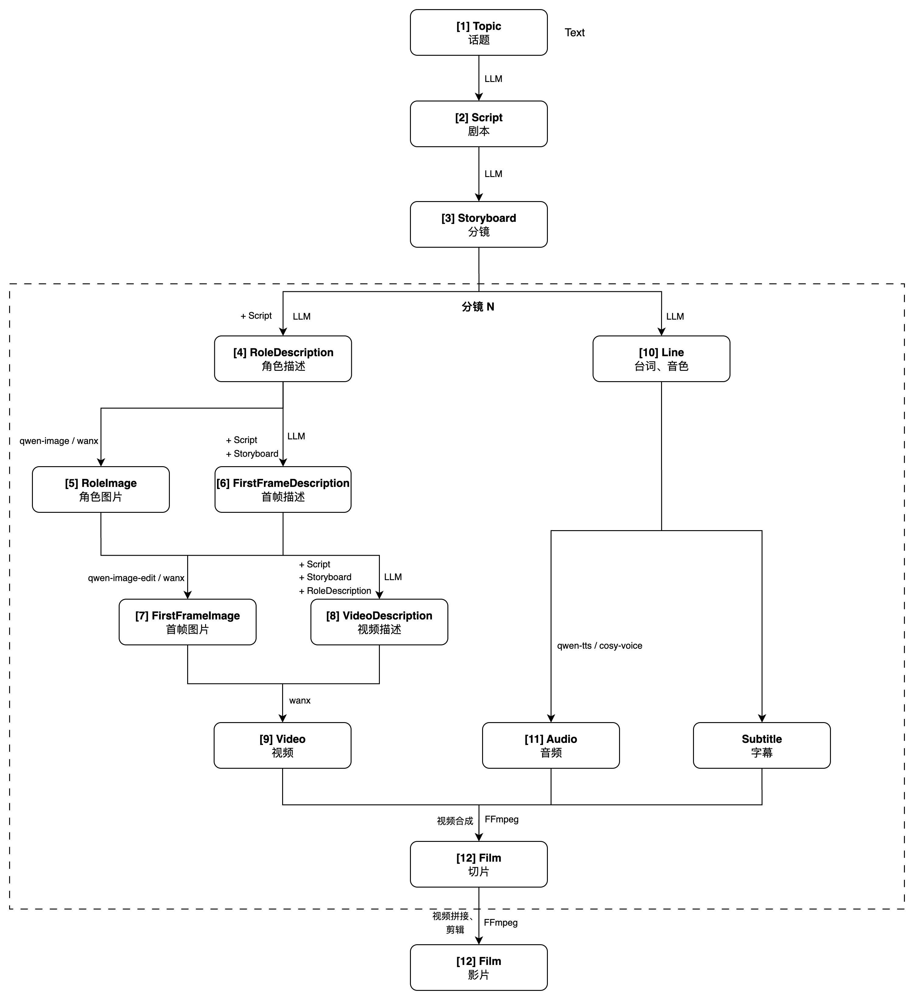

# 多模态视频生成 Demo

## 项目简介

本示例是一个多模态视频生成系统，能够根据用户输入的产品主题，自动生成完整的电商广告短视频。系统采用多阶段流水线架构，通过大语言模型、文生图、图生视频、文本转语音等多种 AI 能力，实现从创意脚本到成品视频的全自动化生成。

## 功能特点

- **智能意图识别**：自动识别用户输入意图，支持脚本生成、分镜设计、角色创作等多种指令
- **多阶段流水线**：包含 12 个处理阶段，从脚本创作到视频合成的完整工作流
- **多模态生成能力**：
  - 文本生成：基于 qwen-max 模型生成创意脚本、分镜描述、角色描述等
  - 图像生成：使用 wan2.2-t2i-plus 模型生成角色形象和首帧图像
  - 视频生成：基于 wan2.2-i2v-plus 模型实现图生视频
  - 语音合成：使用 qwen-tts 模型生成配音
  - 视频合成：自动合成视频片段并添加字幕
- **灵活的会话管理**：支持多轮对话，可随时修改脚本、分镜或重新生成
- **流式响应**：支持流式输出，实时展示生成进度

## 系统架构

### 处理流程



系统包含以下 12 个处理阶段：

1. **Topic（主题输入）**：接收用户输入的产品主题或需求
2. **Script（脚本生成）**：生成电商广告创意脚本
3. **Storyboard（分镜设计）**：将脚本拆解为多个分镜
4. **RoleDescription（角色描述）**：生成角色的详细描述
5. **RoleImage（角色形象）**：根据角色描述生成角色图像
6. **FirstFrameDescription（首帧描述）**：生成每个分镜的首帧描述
7. **FirstFrameImage（首帧图像）**：生成每个分镜的首帧图像
8. **VideoDescription（视频描述）**：生成视频生成所需的运镜描述
9. **Video（视频生成）**：基于首帧图像和分镜描述生成视频片段
10. **Line（台词生成）**：为每个分镜生成角色台词
11. **Audio（语音合成）**：将台词转换为语音
12. **Film（视频合成）**：合成所有视频片段，添加字幕和配音

### 核心组件

- **FilmAgent**：主控 Agent，负责协调整个生成流程
- **Classifier**：意图分类器，识别用户指令并决定执行哪个阶段
- **StageSession**：会话管理器，维护各阶段的生成结果
- **Handler**：各阶段的处理器，负责具体的生成任务

## 快速开始

### 环境要求

- Python 3.10+
- 百炼平台 API Key
- 阿里云 OSS（用于存储生成的图像和视频）

### 设置环境变量

配置以下环境变量：

```shell
# 百炼平台 API Key
DASHSCOPE_API_KEY={your_api_key}

# 阿里云 OSS 配置
OSS_ACCESS_KEY_ID={your_ak}
OSS_ACCESS_KEY_SECRET={your_sk}
OSS_ENDPOINT={your_endpoint}
OSS_BUCKET={your_bucket}
OSS_DIRECTORY={your_directory}
```

### 安装依赖

进入项目根目录，安装所需依赖：

```shell
pip install -e .
pip install -r demos/multimodal_generation/backend/requirements.txt
```

主要依赖包括：
- `agentscope-runtime`：AgentScope Runtime 框架
- `moviepy`：视频编辑处理
- `oss2`：阿里云 OSS SDK

### 配置后端服务

配置文件位于 `backend/config.json`，可以调整各阶段使用的模型和参数：

```json
{
    "intent": {
        "model": "qwen-max"
    },
    "script": {
        "model": "qwen-max",
        "t2i_model": "wan2.2-t2i-plus",
        "vl_model": "qvq-max"
    },
    "storyboard": {
        "model": "qwen-max",
        "max_boards": 2,
        "max_roles": 2
    },
    "role_image": {
        "model": "wan2.2-t2i-plus",
        "rps": 2
    },
    "video": {
        "model": "wan2.2-i2v-plus",
        "rps": 2
    },
    "audio": {
        "model": "qwen-tts"
    },
    "film": {
        "font_size": 60,
        "font_color": "white",
        "fadein_duration": 0.5
    }
}
```

### 执行测试用例

#### 方式一：以服务形式启动后端

```shell
cd agentscope-bricks
export PYTHONPATH=$(pwd):$PYTHONPATH
python demos/multimodal_generation/backend/app.py
```

服务启动后，默认监听 `http://0.0.0.0:8080`

启动客户端：

```bash
export PYTHONPATH=$(pwd):$PYTHONPATH
python demos/multimodal_generation/backend/test/agent_api_client.py
```

客户端收到的最终结果的日志示例如下：
```json
{
    "sequence_number": 1,
    "object": "response",
    "status": "completed",
    "error": null,
    "id": "response_6f1713c2-4631-432c-8e84-22d78e5e6bfb",
    "created_at": 1761701161,
    "completed_at": null,
    "output": [
        {
            "sequence_number": 0,
            "object": "message",
            "status": "completed",
            "error": null,
            "id": "msg_8ae0b947-43af-41ee-bb9d-c476415b6329",
            "type": "message",
            "role": "assistant",
            "content": [
                {
                    "sequence_number": null,
                    "object": "content",
                    "status": "completed",
                    "error": null,
                    "type": "data",
                    "index": 0,
                    "delta": false,
                    "msg_id": "msg_8ae0b947-43af-41ee-bb9d-c476415b6329",
                    "data": {
                        "video_url": "https://bailian-cn-beijing.oss-cn-beijing.aliyuncs.com/multimodal_generation%2Fmock_session_id%2Ffilm.mp4?OSSAccessKeyId=LTAI5tSr8GHZekwmKPw28SMf&Expires=1761707925&Signature=wHKTKJlHy2nZB4ZHxAwvf2uVHuY%3D"
                    }
                }
            ],
            "code": null,
            "message": null,
            "usage": null
        }
    ],
    "usage": null,
    "session_id": null
}
```

#### 方式二：仅测试后端程序

```shell
cd agentscope-bricks
export PYTHONPATH=$(pwd):$PYTHONPATH
python demos/multimodal_generation/backend/test/utils.py
```

后端打印的最终结果的日志如下：
```json
{
    "time": "2025-10-29 10:38:07.242",
    "step": "film_stage_end",
    "model": "",
    "user_id": "",
    "code": "",
    "message": "",
    "task_id": "",
    "request_id": "f67c883a-1e2b-48e8-a319-cf9fd0ec19cc",
    "context": {
        "sequence_number": null,
        "object": "message",
        "status": "completed",
        "error": null,
        "id": "msg_eea15b5e-9b01-4d86-a894-a9f943df7894",
        "type": "message",
        "role": "assistant",
        "content": [
            {
                "sequence_number": null,
                "object": "content",
                "status": "completed",
                "error": null,
                "type": "data",
                "index": 0,
                "delta": false,
                "msg_id": "msg_eea15b5e-9b01-4d86-a894-a9f943df7894",
                "data": {
                    "video_url": "https://bailian-cn-beijing.oss-cn-beijing.aliyuncs.com/multimodal_generation%2Fmock_session_id%2Ffilm.mp4?OSSAccessKeyId=LTAI5tSr8GHZekwmKPw28SMf&Expires=1761709087&Signature=4cDl6Kq94RYalKDUBrxljRi0qtA%3D"
                }
            }
        ],
        "code": null,
        "message": null,
        "usage": null
    },
    "interval": {
        "type": "film_stage_end",
        "cost": "28.779"
    },
    "ds_service_id": "test_id",
    "ds_service_name": "test_name"
}
```


## 注意事项

1. **资源消耗**：完整生成一个视频需要调用多个 AI 模型，可能需要较长时间（几分钟到十几分钟）
2. **成本控制**：图像生成、视频生成和语音合成都会产生 API 调用费用
3. **OSS 存储**：生成的图像和视频会上传到 OSS，请确保有足够的存储空间
4. **网络要求**：需要稳定的网络连接以调用百炼平台 API
5. **会话管理**：当前使用内存存储会话，服务重启后会话数据会丢失