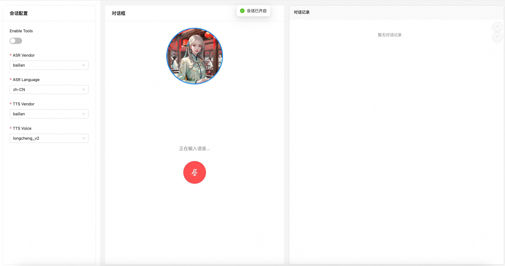

## 快速开始

本示例包含了用户使用realtime进行语音通话的场景，使用时候注意背景噪音。

同时， **Enable Tool 还在试验阶段** 后续可配合终端支持如打电话，播放音乐等能力。

### 启动后端服务
```shell


# 配置百炼API Key
export DASHSCOPE_API_KEY={your_api_key}

# 配置微软Key和Region 如果需要使用的话。
export AZURE_KEY={your_api_key}
export AZURE_REGION={your_region}

export PYTHONPATH=$(pwd):$PYTHONPATH && python demos/realtime/backend/voice_chat_serivce.py
```

## 启动前端
```shell
cd demos/realtime/frontend

# 安装
npm install

# 启动
npm start
```

## 开始对话

访问 http://localhost:3000

先进行会话配置，配置项说明：
- Enable Tools: 若打开工具调用，当命中工具时，则显示返回对应的tool_calls信息
- ASR Vendor：ASR厂商名称
- ASR Language：ASR识别语言
- TTS Vendor：TTS厂商名称
- TTS Voice：TTS音色

然后点击页面中的麦克风按钮，开始对话：



