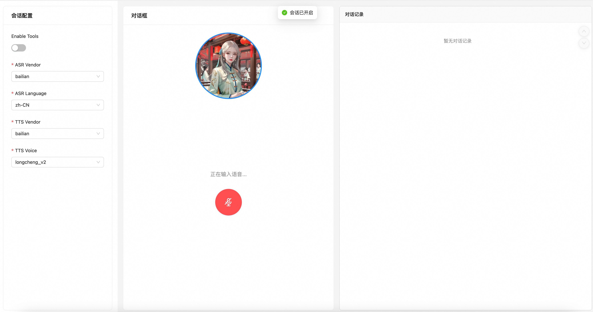

## Quick Start

This example demonstrates a scenario where users conduct voice calls using realtime functionality. Please be mindful of background noise when using it.

Additionally, **Enable Tool is still in experimental stage** and will support capabilities such as making phone calls and playing music in conjunction with terminal support in the future.

### Start Backend Service
```shell
# First navigate to the root directory of this project

# Install dependencies
pip install -e .
pip install -r demos/voice_chat/backend/requirements.txt

# Configure Modelstudio API Key
export DASHSCOPE_API_KEY={your_api_key}

# Configure Microsoft Key and Region (if needed)
export AZURE_KEY={your_api_key}
export AZURE_REGION={your_region}

export PYTHONPATH=$(pwd):$PYTHONPATH && python demos/voice_chat/backend/app.py
```

## Start Frontend
```shell
# First navigate to the root directory of this project

cd demos/voice_chat/frontend/

# Install
npm install

# Start
npm start
```

## Start Conversation

Visit http://localhost:3000

First configure the session settings. Configuration options explained:
- Enable Tools: If tool calling is enabled, when tools are triggered, the corresponding tool_calls information will be displayed
- ASR Vendor: ASR vendor name
- ASR Language: ASR recognition language
- TTS Vendor: TTS vendor name
- TTS Voice: TTS voice tone

Then click the microphone button on the page to start the conversation:

